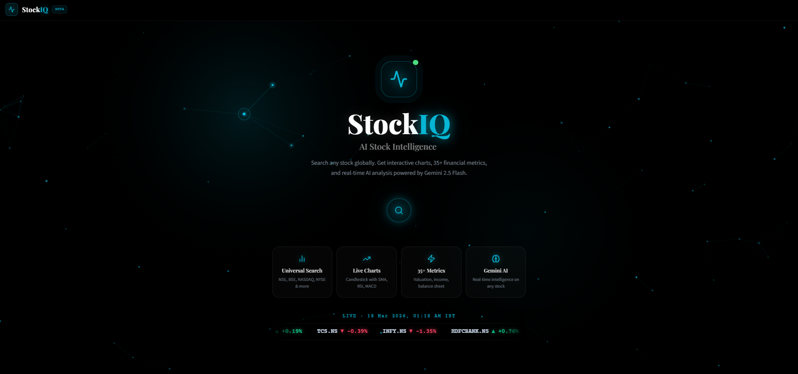
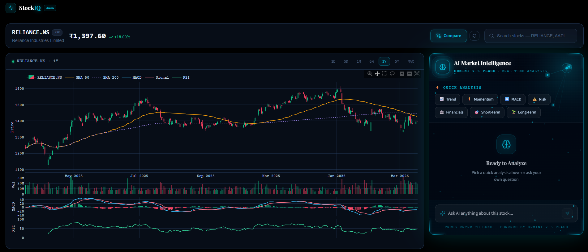
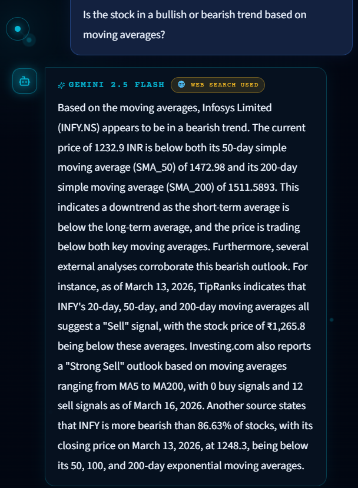
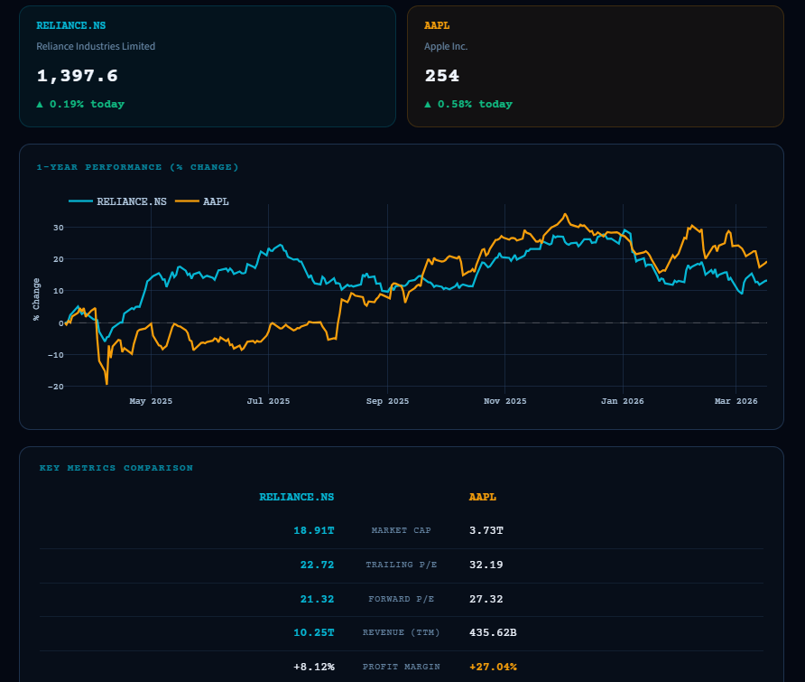

## 🚀 Demo Preview

### Homepage


### Charts


### AI Chatbot Insights


### Stock Comparison


# StockIQ — AI Stock Intelligence Dashboard

A full-stack AI-powered stock analysis dashboard built with FastAPI and React. Search any stock globally, get interactive candlestick charts with technical indicators, 35+ financial metrics, stock comparison, and real-time AI analysis powered by Gemini 2.5 Flash.


---

## Features

- **Universal Stock Search** — NSE, BSE, NASDAQ, NYSE and more
- **Interactive Charts** — Candlestick with SMA 50, SMA 200, RSI, MACD
- **35+ Financial Metrics** — Valuation, income statement, balance sheet, growth metrics
- **Stock Comparison** — Normalized performance chart + side-by-side metrics for any two stocks
- **AI Market Intelligence** — Ask anything about a stock, powered by Gemini 2.5 Flash with Google Search grounding
- **Live Ticker Tape** — Real-time prices fetched in parallel on the home screen
- **Particle Constellation UI** — Custom canvas animation with mouse interaction

---

## Project Structure

```
Stock_IQ/
├── stock_backend/          ← FastAPI backend
│   ├── main.py             ← All API endpoints
│   ├── requirements.txt
│   ├── .env.example
│   ├── data_sources/
│   │   ├── ticker_search_service.py
│   │   └── yfinance_service.py
│   └── analysis/
│       └── technical_indicators.py
└── stock_frontend/         ← React + Vite frontend
    ├── src/
    │   ├── components/
    │   ├── pages/
    │   ├── hooks/
    │   ├── services/
    │   └── utils/
    ├── package.json
    └── vite.config.js
```

---

## Getting Started

### Prerequisites

- Python 3.10+
- Node.js 18+
- A free [Gemini API key](https://aistudio.google.com/app/apikey)

---

### 1. Backend Setup

#### Create and activate a virtual environment

**Windows:**
```bash
cd stock_backend
python -m venv venv
venv\Scripts\activate
```

**Mac/Linux:**
```bash
cd stock_backend
python -m venv venv
source venv/bin/activate
```

You should see `(venv)` at the start of your terminal line.

#### Install dependencies

```bash
pip install -r requirements.txt
```

#### Create the `.env` file

Create a file named `.env` inside the `stock_backend/` folder:

```
GEMINI_API_KEY=your_gemini_api_key_here
```

> Get your free API key at: https://aistudio.google.com/app/apikey

#### Run the backend

```bash
uvicorn main:app --reload --port 8000
```

Backend runs at: **http://localhost:8000**
API docs at: **http://localhost:8000/docs**

---

### 2. Frontend Setup

Open a new terminal window:

```bash
cd stock_frontend
npm install
npm run dev
```

Frontend runs at: **http://localhost:5173**

> Make sure the backend is running before opening the frontend.

---

## API Endpoints

| Method | Endpoint | Description |
|--------|----------|-------------|
| GET | `/search?q=reliance` | Search stocks by name or ticker |
| GET | `/chart?ticker=AAPL&timeframe=1Y` | OHLCV data + SMA, RSI, MACD |
| GET | `/financials?ticker=AAPL` | 35+ financial metrics |
| POST | `/ai-analysis` | Gemini AI analysis with web search |
| GET | `/tickers` | Live prices for ticker tape |
| GET | `/compare?ticker1=AAPL&ticker2=TSLA` | Side-by-side stock comparison |
| GET | `/health` | Backend health check |

---

## Tech Stack

**Frontend**
- React 18 + Vite
- Tailwind CSS
- Framer Motion — animations
- Plotly.js — interactive candlestick charts
- Axios — API calls
- HTML5 Canvas — particle constellation animation

**Backend**
- FastAPI + Uvicorn
- yfinance — real-time stock data
- Pandas — technical indicator calculations
- Python ThreadPoolExecutor — parallel data fetching

**AI & Data**
- Gemini 2.5 Flash — AI stock analysis
- Google Search Grounding — real-time web search in AI responses

---

## Environment Variables

| Variable | Description | Required |
|----------|-------------|----------|
| `GEMINI_API_KEY` | Google Gemini API key | Yes |

---

## Notes

- The `venv/` and `.env` files are excluded from version control via `.gitignore`
- Never commit your `.env` file — it contains your API key
- The frontend proxies all `/api/*` requests to the backend via Vite's dev server config
